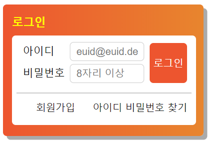

# mission-02

## 마크업 코드

---
### 초기 컨테이너 설정

```html
<body>
  <div class="login-wrap">
    <div class="login-form">
     <form><fieldset><legend></legend></fieldset></form>
     <ul class="find-wrap"><li></li><li></li></ul>
    </div>
  </div>
</body>
```

### 아이디 input 구현 
아이디와 비밀번호 요소에 block속성을 주기 위해서 div로 묶었습니다.

```html
<div class="login-id">
  <label for=id>아이디 </label>
  <input type="email" id="id" name="id" placeholder="euid@euid.de" required >
</div>
```

### 비밀번호 input 구현

```html
<div class="login-pw">
  <label for="pw">비밀번호</label>
  <input type="password" id="pw" name="pw" placeholder="8자리 이상" required minlength="8" />
</div>
```

### 로그인 버튼 구현
fieldset에 position:relative 속성을  주어서 기준으로 정하고 버튼에 position:absolute 속성을 주어서 위치를 조정했습니다.

```html
<button type="submit" class="btn-login">로그인</button>
```

### 회원가입/아이디/비밀번호 찾기 구현
회원가입에 float: left 속성을 아이디비밀번호찾기에 float: right 속성을 주어서 배치하였습니다.

```html
<ul class="find-wrap">
  <li>
    <a href="/" class="sign-text" aria-label="회원가입">회원가입</a>
  </li>
  <li>
    <a href="/" class="find-text" aria-label="아이디 및 비밀번호 찾기">아이디 비밀번호 찾기</a>
  </li>
</ul>
```

## 완성 UI

---


