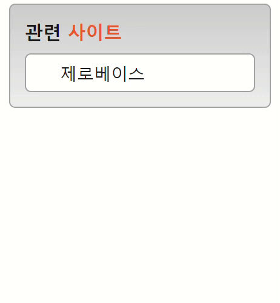

# mission-03

## 마크업 코드

### 초기 컨테이너 설정
```html
<section class="container">
    <h3 class="link-header">
      <span class="link-header__text-color"></span> <!-- 사이트 글자색을 따로 지정하기 위해서 span태그를 사용했습니다 -->
    </h3>
    <div class="link-wrap">
      <ul class="link-group">
        <li><a href="/"></a></li>
        <li><a href="/"></a></li>
        <li><a href="/"></a></li>
        <li><a href="/"></a></li>
        <li><a href="/"></a></li>
      </ul>
    </div>
  </section>
```

### transition 구현
```css
/* ul를 감싸는 div태그에 height와 overflow:hidden을 주어서 list의 링크가 하나만 보이도록 하였습니다.  */
.link-wrap{
  overflow: hidden;
  height: 30px;
  transition: 0.4s;
}

/* hover했을때 list의 모든 링크가 보이도록 height값을 주고 transition속성으로 천천히 height값이 늘어나도록 하였습니다.  */
.link-wrap:hover{
  height: 170px;
  transition: height 0.7s;
}

/* hover했을때 ul태그가 padding-top값 만큼 천천히 밑으로 이동하도록 transition속성을 주었습니다 */
.link-group:hover{
  padding-top: 10px;
  transition: padding-top 0.3s ease-in-out 0.4s;
}
````

### 유효성 검사 완료
___

## 완성 UI
