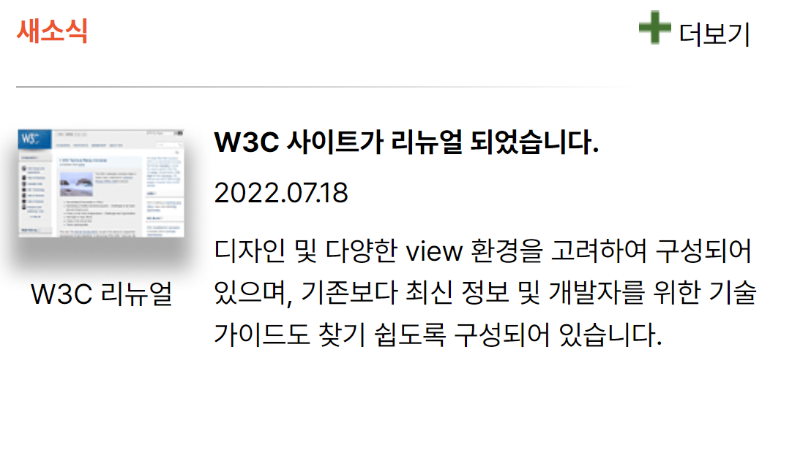

# mission-04

## 마크업 코드

---

### 초기 컨테이너 설정

```html
<main>
  <section class="news">
    <h3 class="news-header"></h3>
    <span class="news-more"></span>

    <span class="hr"></span> <!-- 밑줄 표현을 위한 태그입니다. -->

    <figure class="news-img">
      
      <figcaption></figcaption>
    </figure>

    <!-- 제목과 날짜를 같이 배치하기위해서 div태그로 묶었습니다. -->
    <div class="news-group">
      <p class="news-title"></p>
      <p class="news-date"></p>
    </div>

    <p class="news-content"></p>
  </section>
</main>
```

### Grid 설정

```css
.news {
  display: grid;
  grid-template-columns: repeat(5, 1fr);
  grid-template-rows: repeat(5, 1fr);
}

.news-header {
  grid-row: 1 / 1;
  grid-column: 1 / 5;
}

.news-more {
  grid-row: 1 / 1;
}

.hr {
  grid-row: 2 / 2;
  grid-column: 1 / 5;
}

.news-img {
  grid-row: 3 / 5;
  grid-column: 1 / 1;
}

.news-group {
  grid-row: 3 / 3;
  grid-column: 2 / 6;
}

.news-content {
  grid-column: 2 / 6;
}
```

### 유효성 검사 완료

---

## 완성 UI


