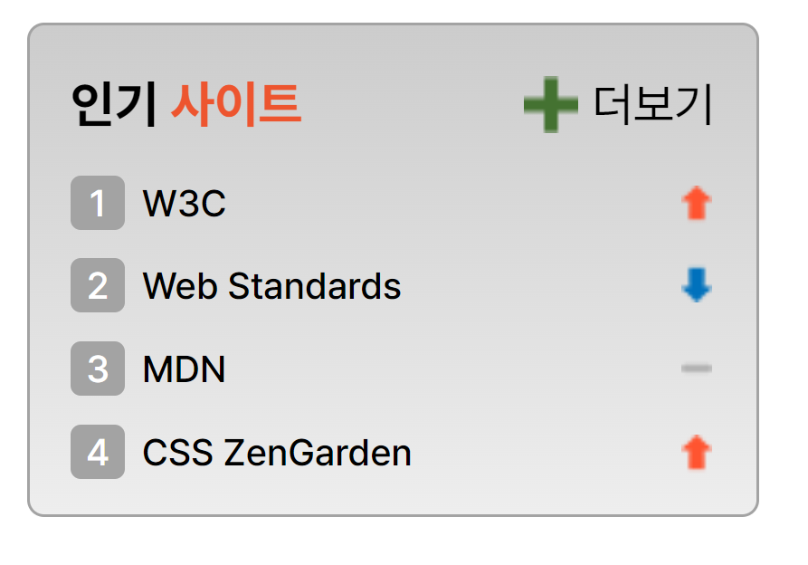

# mission-05

## 마크업 코드

---

### 초기 컨테이너 설정

```html
<section class="popular-container">
  <h2 class="popular-header"><span class="accent-color"></span></h2>
  <ol class="popular-wrap">
    <li class="popular-site sprite sprite-rank-01">
      <span class="rank-color">1</span>
      <a href="/"></a>
    </li>
    <li class="popular-site sprite sprite-rank-02">
      <span class="rank-color">2</span>
      <a href="/"></a>
    </li>
    <li class="popular-site sprite sprite-rank-03">
      <span class="rank-color">3</span>
      <a href="/"></a>
    </li>
    <li class="popular-site sprite sprite-rank-04">
      <span class="rank-color">4</span>
      <a href="/"></a>
    </li>
  </ol>
  <a href="/" class="popular-more"></a>
</section>
```

### 스프라이트 기법

순위가 등락하는 이미지를 스프라이트 기법을 통해서 표현했습니다.

```css
/* 스프라이트 설정 */
.sprite {
  background: url(./../images/rank.png) no-repeat;
}
.sprite-rank-01 {
  background-position: 180px 3px;
  padding-left: 1px; /* W3C의 글자배치를 맞추고자 패딩값을 주었습니다. */
}
.sprite-rank-02 {
  background-position: 180px -42px;
}
.sprite-rank-03 {
  background-position: 180px -19px;
}
.sprite-rank-04 {
  background-position: 180px 3px;
}
```

### list 스타일

list 숫자를 회색배경으로 스타일 하기위해서 가상요소 선택자를 사용했습니다. <br/> 가상요소 선택자에 배경컬러를 설정하고 포지션을 사용해서 위치를 잡았습니다. <br/>그리고 z-index를 사용해서 숫자가 보이도록 배치하였습니다.

```html
<li class="popular-site sprite sprite-rank-01">
  <span class="rank-color">1</span> 
  <a href="/">W3C</a>
</li>
```
```css
.popular-container {
  position: relative;
  z-index: 1;
}

.popular-site::after {
  content: '';
  position: absolute;
  left: 12px;
  width: 16px;
  height: 16px;
  background: var(--border-color);
  border-radius: 3px;
  z-index: -1;
}

.rank-color{
  padding: 5px;
  margin-right: 2px;
  color: var(--white);
}
```

### 유효성 검사 완료

---

## 완성 UI


